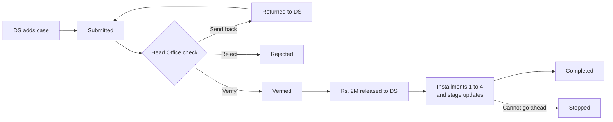

# Diviyata Sawiyak — Product Requirements Document

2026-09-28, updated 2026-10-07 · Janindu Pramod

> **Status:** draft, awaiting approval. This file mirrors the [review copy](https://claude.ai/code/artifact/9b67ede5-1f80-41e8-96be-0af36e03eda2) of the PRD.

## Overview

Diviyata Sawiyak (දිවියට සවියක්) is a web system to replace the Google Sheet that the Ministry of Women and Child Affairs uses to run this housing programme. Head Office and every Divisional Secretariat (DS) will use it on office PCs, with screens in Sinhala, Tamil and English. For each case it records the Rs. 2,000,000 released, the four installments paid from that amount, and the work done on the ground.

- **Who it helps.** Two groups. Care leavers are young people who grew up in a child-care institution and are now 18 or older. Children at risk are vulnerable children in at-risk families, and their cases are recorded under the child's guardian.
- **Who selects them.** Each DS selects its beneficiaries after its own field research. Head Office then checks each case and verifies or rejects it.
- **What they get.** One of two kinds of help: a new house, or the renovation of an existing house. Land-only cases have not started and are not part of this system.
- **The money.** For each verified case the Ministry releases Rs. 2,000,000 to the DS. The DS pays it out in four installments of Rs. 500,000.
- **The work.** A house is tracked through four stages: foundation, walls, roof and completed.
- **Size today.** The sheet holds 729 cases from all 25 districts: 240 care leavers and 489 children at risk.

## The problem today

The Google Sheet holds progress as free-text notes, not amounts, dates or statuses. No one can total the money, count finished houses or find stuck cases from it.

Today the process runs like this:

1. The DS selects beneficiaries after field research and adds a row to the care-leaver tab (නිවාසගත) or the children-at-risk tab (අවදානම් දරුවන්).
2. Head Office reviews the rows and verifies or rejects each case, but the sheet has no place to record that decision.
3. For each verified case, the Ministry releases Rs. 2,000,000 to the DS.
4. As work goes on, the DS types notes into four installment columns and four stage columns (Foundation, Wall, Roof, Completed).

What the sheet showed on 25 Sep 2026:

| Problem | What the sheet shows |
| --- | --- |
| Money columns hold notes, not amounts | No installment cell holds a rupee amount. Cells say things like "No", "released", "expected on the 17th" or "file sent to the accounts division". |
| Blank cells are ambiguous | 615 of 729 cases have no installment entry at all, and a blank can mean "not started" or "not updated". Only 6 cases have anything past the first installment, and 10 have a building stage. |
| A case has no status | Decisions hide in free text, such as "not recommended for assistance" or "another name submitted for approval". 66 rows use cell colours that have no legend. |
| Identity details are missing | NIC is blank for 238 of 240 care leavers and 452 of 489 guardians. The phone number is blank for 20 and 444 of them. |
| Places are typed freely | The 25 districts appear under 28 labels, mixing Sinhala and English ("Matara" and "මාතර"). Province is not recorded. |
| Key facts have no column | Nothing records the kind of help (new house or renovation), the Rs. 2M release, or any date. |
| No evidence | Photos, bills and site reports are not in the sheet. |
| Everyone sees everything | Every DS with edit access can see and change every family's name, address and phone number, nationwide. |
| No rule for siblings | 9 guardians appear on 2 or 3 rows each, one row per child (20 rows in all). |

## Goals and success measures

Version 1 succeeds when the sheet is retired and Head Office can see every case's status, money and progress in one place, as it happens.

- **One record per case.** Every case lives in the system with a clear status, from the DS's first entry to completion.
- **Money accounted for.** For every case, you can see what was released to the DS, what has been paid out and what remains.
- **Progress you can see.** DS offices record each installment and stage with dates, and photos when they have them, so Head Office can follow along without phoning.
- **The right people see the right cases.** A DS sees only its own cases, and every change is logged.
- **Clean data.** NIC, phone number, district and DS are entered in one consistent form.

The targets below are proposals for the Ministry to confirm.

| Measure | Target |
| --- | --- |
| Sheet cases moved into the system | All 729, within 1 month of launch |
| DS offices using the system | Every DS with a case, within 2 months of launch |
| Edits to the sheet after the switch | None |
| Time from submission to a Head Office decision | Median under 7 days |
| In-progress cases updated in the last 30 days | 90% or more |
| New cases with a valid NIC and phone number | 100% |
| Time to get a national progress report | Under 1 minute |

## Users

Version 1 has three kinds of login, as decided on 24 Sep. Beneficiaries do not log in.

| Role | Who they are | What they do | Cases they see |
| --- | --- | --- | --- |
| DS officer | The Child Rights Promotion Officer (ළමා හිමිකම් ප්‍රවර්ධන නිලධාරී) of a Divisional Secretariat (the AG office), working on an office PC. Each DS has one, and they run the system for their DS | Adds and submits cases, fixes cases sent back, updates installments and stages, adds photos and notes | Their own DS only |
| Head Office officer | Ministry programme staff | Verifies, sends back or rejects cases, records each Rs. 2M release, adds and edits cases, follows progress, runs reports | All cases |
| Head Office admin | Ministry staff who run the system | Creates and disables accounts, resets passwords, keeps the lists of districts, DS divisions and stages | None: accounts and lists only |

What each role needs most:

- **DS officer:** simple screens on the office PC, in Sinhala, Tamil or English, and a clear list of what to do next.
- **Head Office officer:** a queue of cases to check, a national picture by district and DS, and early warning of stuck cases.
- **Head Office admin:** fast setup of each DS office's officer account at launch.

## How a case moves

A case goes from the DS to Head Office for a check. Once verified, it receives its Rs. 2,000,000 and moves through four installments and the building stages.

Each box is a case status. A case sent back is corrected by the DS and submitted again. A case that cannot go ahead is stopped, with the reason recorded.

| Step | Who | What is recorded |
| --- | --- | --- |
| Add and submit | DS officer, or a Head Office officer | Category, kind of help, beneficiary details, other documents if any |
| Check | Head Office officer | Verify, send back or reject, with a reason |
| Release Rs. 2M | Head Office officer | Date, amount, reference number, and a note on what it covers |
| Installments 1 to 4 | DS officer | What the money is for, status, expected date, released date |
| Stage updates | DS officer | Stage reached, date, notes, photos |
| Complete | The system | Set when installment 4 is released and the last stage is reached |
| Stop | Head Office officer | Date and reason |

## Main features

Version 1 covers a case from first entry to completion, with dashboards, history and account tools around it.

### Cases

- Add a case on one page with four numbered parts: category, kind of help, the beneficiary's details, and other documents if any. Then submit it.
- Save a case as a draft and finish it later.
- Warn when an NIC is already on another case anywhere in the country. If that case is in another DS, show only its number and DS.
- Fill in the province and district from the DS, so officers never type them.
- Find cases by name, NIC, index number, DS, district, status, category or kind of help.

### Head Office check

- A queue of submitted cases, oldest first.
- Narrow the queue to a district or a DS division, showing how many cases wait in each.
- Release money by district (6 Oct 2026): one allocation letter to a District Secretary for several verified cases of the district, with its number, date, last valid day, an optional scan and the total of Rs. 2,000,000 per case. This answers open question 9.
- Verify a case, send it back with comments, or reject it with a reason.
- Keep every decision and comment in the case's history.

### Rs. 2M release

- Record the release for a verified case: date, amount, reference number and a note.
- Show how much was released and how much has been paid out, per case, DS, district and nationally.

### Installments

- For each of the four installments, record what the money is for, its status, the expected date and the released date.
- Allow installments to be marked released only in order.

### Progress on the ground

- Record each stage reached, with its date and a note.
- Add photos and documents such as bills or reports, when the officer has them.
- Show Head Office the latest photos and notes on each case.

### Dashboards and reports

- Head Office dashboard: cases by status, category, kind of help, district and DS; money released and paid out; houses at each stage; cases with no update in 30 days.
- DS dashboard: the office's own cases and what needs doing next.
- Export any list to Excel.

### History and alerts

- Log every change: who made it, what changed and when.
- Alert users inside the system when a case is sent back, verified or rejected, or when money is released.

### Accounts and lists

- Create an account for each named officer. Each DS has one Child Rights Promotion Officer, so it has one active DS officer account. When the officer changes, disable the old account and create one for the new officer.
- Give each new account a temporary password, which the officer must change at first login. Reset passwords the same way.
- Disable the account of an officer who leaves; their past changes stay in the history. Move an officer to another DS when they transfer.
- Keep the lists of provinces, districts, DS divisions, and the stages for new houses and renovations. Entries are never deleted.

### Moving off the sheet

- Bring the 729 sheet cases into the system. How is open: a one-time import was built, then removed on 6 Oct 2026, because the sheet is still being updated.

## Programme rules

Rules marked Decided come from the brief or the 24 Sep decisions. Rules marked Proposed need the Ministry's approval; set each to Approved or Rejected once agreed.

| Rule | Detail | Status |
| --- | --- | --- |
| Money per case | Rs. 2,000,000, released once by the Ministry to the DS, only for a verified case | Decided |
| Four fixed installments | Rs. 500,000 each; the amounts can't be changed | Decided |
| Installment status | Not started → Processing (with an expected date) → Released (with the date) | Decided |
| Order | An installment can be marked Released only after the one before it | Decided |
| Who releases installments | The DS checks the site and marks each installment; Head Office does not approve them | Decided |
| Stages and money | The stage reached never blocks an installment | Decided |
| Photos and documents | Optional, and never block anything. A case can be submitted with no documents | Decided |
| Kinds of help | A new house or the renovation of an existing house only. Land cases have not started, so they stay out of the system | Decided |
| Who sees what | A DS officer sees only their own DS; Head Office sees every case | Decided |
| One officer per DS | Each DS has one Child Rights Promotion Officer, who runs the system for that DS, so a DS has one active DS officer account (decided 29 Sep) | Decided |
| Send back | Head Office can return a case for correction instead of rejecting it | Proposed |
| Editing a verified case | Only Head Office can change a verified case's details, and every change is logged | Proposed |
| Nothing is deleted | Rejected and stopped cases stay in the system with their reasons | Proposed |
| When a case is complete | Installment 4 is released and the last stage is reached | Proposed |
| One account per person | Each account belongs to one named officer, and offices don't share a login. When the officer changes, the old account is disabled and the new officer gets their own | Proposed |
| NIC found in another DS | The DS officer sees only the other case's number and DS, not the person's details. Head Office sees everything | Proposed |

## What a case records

A case holds the basic details from the brief, plus the category and the kind of help, which the sheet never recorded.

| Field | What it holds | In the sheet today |
| --- | --- | --- |
| Index number | A unique number given by the system | Serial number (අනු අංකය), kept as a reference |
| Category | Care leaver or child at risk, chosen first | Which tab the row is on |
| Kind of help | New house or renovation | Not recorded |
| Full name | The care leaver, or the child's guardian | නම / භාරකරුගේ නම |
| Child's name | Children at risk only | දරුවාගේ නම |
| NIC | The care leaver's or the guardian's, checked against every other case | ජාතික හැඳුනුම්පත් අංකය, mostly blank |
| Address | Postal address | ලිපිනය |
| Mobile number | Up to two numbers | දුරකතන අංකය, sometimes two or three in one cell |
| Province, district, DS | Picked from lists, set by the DS | දිස්ත්‍රික්කය and ප්‍රා.ලේ. කොට්ඨාසය, typed freely; no province |
| Documents | Other documents, optional | Not recorded |
| Remark | Free text | Remark |

For each verified case the system also keeps:

- **The Rs. 2M release:** date, amount, reference number and a note, entered by Head Office.
- **Four installments:** what the money is for, status, expected date, released date and a note, entered by the DS.
- **Stage updates:** the stage reached, its date, a note, photos and documents, entered by the DS.
- **History:** every change, decision and comment, with who made it and when.

## Scope

Version 1 replaces the sheet end to end for all three roles. Paying out money and serving beneficiaries directly stay outside the system.

### In version 1

- Every item under Main features, for all DS offices and Head Office.
- Screens in Sinhala, Tamil and English, designed for office PCs. Each officer picks the language; Sinhala is the default.
- Bringing the 729 sheet cases into the system (how is open; see Moving off the sheet).

### Later

- SMS or email alerts.
- Offline entry at sites with no signal, synced when back online.
- Photo locations and a map of cases.
- A printable case file (PDF).
- Read-only logins for District Secretariats or auditors.

### Out of scope

- Moving money. The system records releases, but payments still go through the Ministry's and the DS's accounts processes.
- Land-only cases. The programme gives only new houses and renovations for now.
- Logins or a public website for beneficiaries.
- The DS's field research to select beneficiaries. The system stores only the outcome, and any documents the DS attaches.
- Contractors, procurement and building materials.
- Android or iPhone apps. The system is a website used on office PCs.
- The Ministry's other programmes.

## Constraints

The system holds children's personal data, and it must be easy for non-technical officers who work in Sinhala or Tamil.

- **Devices.** Office PCs with a web browser; nothing is installed. Screens are designed for desktop first, for DS officers as well as Head Office.
- **Language.** Screens come in Sinhala, Tamil and English (7 Oct 2026, answering question 8), because the system is used by Sinhala-, Tamil- and English-speaking officers. Sinhala is the default. Each officer picks a language on the sign-in page or in the header, and the browser remembers it. Districts, DS offices and building stages are named in all three languages, and each screen shows only its own language's name (8 Oct 2026); what officers type is kept as typed. Excel files come in the language of the screen. The Tamil and English wording, and the Tamil place names, need checking by the Ministry before go-live.
- **Ease of use.** Each screen does one main task, in plain words, using the sheet's own terms such as නිවාසගත and පළමු වාරිකය.
- **Personal data.** Cases hold the names, NICs, addresses and phone numbers of children and vulnerable families. Handling must meet the [Personal Data Protection Act, No. 9 of 2022](https://www.dpa.gov.lk/Background.php): each role sees only what it needs, and every change is logged.
- **Real data stays out of the code.** The sheet is never copied into the code repository, and tests use made-up cases.
- **Hosting, storage and backups.** The system, its database, and its photos and documents stay on a server in Sri Lanka, such as the Lanka Government Cloud or a Ministry server; which one is still open (question 4). Files are private and open only after a login and permission check. The database and files are backed up daily, encrypted, to a second place in Sri Lanka. How long records are kept is still open (question 5).

## Open questions for the Ministry

These were set aside on 28 Sep, to be answered later. Until then the [SPEC](SPEC.md#13-deferred-questions-and-the-defaults-used) uses a default for each. Questions 2, 10 and 11 were settled on 28 Sep and removed: land cases stay out of the system, and no documents are required. The other numbers stay the same, because the prototype's notes use them. Question 12 was added on 28 Sep. Question 8 was answered on 7 Oct: the screens come in Sinhala, Tamil and English.

| # | Question | Why it matters |
| --- | --- | --- |
| 1 | Siblings: one case per family, or one per child? | 9 guardians already have 2 or 3 children listed. This decides whether a family can receive Rs. 2M more than once. |
| 3 | What are the renovation stages? | Foundation, walls and roof may not fit repair work. |
| 4 | Where will the system be hosted? | This decides cost, security and who runs it. |
| 5 | How long are records kept? | Rejected, stopped and completed cases hold personal data. |
| 6 | What happens to the money on a stopped case? | One sheet case is already marked as a project that cannot be carried out. |
| 7 | How is a beneficiary replaced? | The sheet has "another name submitted for approval". It could be a new case or an edit. |
| 8 | Is Tamil needed in version 1? **Answered 7 Oct 2026: yes, and English too.** | Northern DS offices typed the sheet in English. |
| 9 | Is the Rs. 2M released case by case, or in batches per DS? | This decides how Head Office records releases. |
| 12 | How does a new officer get their first password? | SMS alerts come later, so for now the admin must pass it on by phone or in person. |
